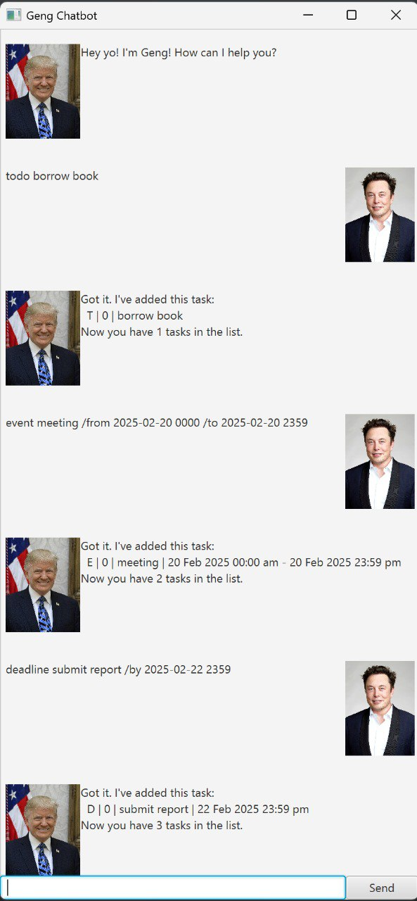

# Geng Chatbot User Guide



Geng Chatbot is a JavaFX application that helps users manage tasks, events, and deadlines. It provides a simple GUI to interact with the chatbot and manage your schedule efficiently.

## Features

### Adding _To-do_ Tasks
Adds a to-do task to the task list.

**Usage:** `todo <task description>`

Example: `todo borrow book`

Expected output:
```
Got it. I've added this task: 
 T | 0 | borrow book 
Now you have X tasks in the list.
```

### Adding _Deadline_ Tasks
Adds a deadline task to the task list.

**Usage:** `deadline <task description> /by <date>`
- `<date>` should be in the format `yyyy-mm-dd HHmm`.

Example: `deadline return book /by 2021-09-30 1800`

Expected output:
```
Got it. I've added this task: 
 D | 0 | return book | 30 Sep 2021 18:00 pm
Now you have X tasks in the list.
```


### Adding _Event_ Tasks
Adds an event task to the task list.

**Usage:** `event <task description> /from <date> /to <date>`
- `<date>` should be in the format `yyyy-mm-dd HHmm`.

Example: `event project meeting /from 2021-09-30 1400 /to 2021-09-30 1600`

Expected output:
```
Got it. I've added this task: 
 E | 0 | project meeting | 30 Sep 2021 14:00 pm - 30 Sep 2021 16:00 pm
Now you have X tasks in the list.
```

### Listing all tasks
Lists all tasks in the task list.

**Usage:** `list`

Expected output:
```
Here are the tasks in your list:
1. T | 0 | borrow book
2. D | 0 | return book | 30 Sep 2021 18:00 pm
3. E | 0 | project meeting | 30 Sep 2021 14:00 pm - 30 Sep 2021 16:00 pm
...
```

### Marking a task as done
Marks a task as done in the task list.

**Usage:** `mark <task number>`
- `<task number>` is the index of the task in the task list, first task is 1, not 0.
- The task number must be a positive integer.
- The task number must be within the range of the task list.

Example: `mark 1`

Expected output:
```
Good Job! I've marked this task as done: T | 1 | borrow book
```

### Unmarking a task as done
Unmarks a task as done in the task list.

**Usage:** `unmark <task number>`
- `<task number>` is the index of the task in the task list, first task is 1, not 0.
- The task number can be obtained by using the `list` command.
- The task number must be a positive integer.
- The task number must be within the range of the task list.

Example: `unmark 1`

Expected output:
```
Oki, I've marked this task as not done yet: T | 0 | borrow book
```

### Deleting a task
Deletes a task from the task list.

**Usage:** `delete <task number>`
- `<task number>` is the index of the task in the task list, first task is 1, not 0.
- The task number must be a positive integer.
- The task number must be within the range of the task list.

Example: `delete 1`

Expected output:
```
Alright! I've removed this task: 
 T | 0 | borrow book
Now you have X tasks in the list.
```

### Finding tasks
Finds tasks that contain the keyword in the task list.

**Usage:** `find <keyword>`
- `<keyword>` is the keyword to search for in the task list.
- The search is case-insensitive.
- The search is a substring search.
- The search is a partial match search.

Example: `find book`

Expected output:
```
1. D | 0 | return book | 30 Sep 2021 18:00 pm
2. T | 0 | borrow book
```

### Listing tasks by date
Lists tasks that occur before, on or within the specified date.

**Usage:** `show <date>`
- `<date>` should be in the format `yyyy-mm-dd`.

Example: `show 2021-09-30`

Expected output:
```
1. D | 0 | return book | 30 Sep 2021 18:00 pm
2. E | 0 | project meeting | 30 Sep 2021 14:00 pm - 30 Sep 2021 16:00 pm
```

### Exiting the application
Exits the application.

**Usage:** `bye`
- The application will output the farewell message below and close after 3 seconds.

Expected output:
```
Thank you for patronising. Hope to see you again soon!
```
